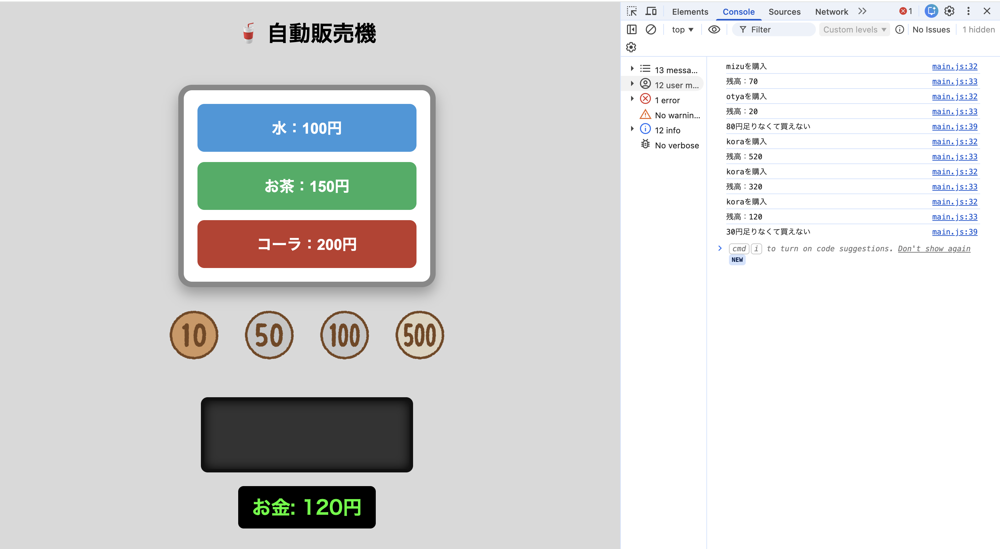

# 🥤 自動販売機アプリ

JavaScript・HTML・CSSを使用して作成した自動販売機シミュレーターです。

コインをドラッグして投入し、飲み物を購入できます。

## 概要

実際の自動販売機をイメージしながら作成したブラウザアプリです。

投入した金額に応じて商品を購入でき、在庫管理や購入取り消し機能も実装しています。

### 購入可能な商品

| 商品  | 価格   | 初期在庫 |
| --- | ---- | ---- |
| 水   | 100円 | 3本   |
| お茶  | 150円 | 2本   |
| コーラ | 200円 | 1本   |

## 使用技術

* HTML
* CSS
* JavaScript

## 機能

### コイン投入

* 10円硬貨
* 50円硬貨
* 100円硬貨
* 500円硬貨

をドラッグ＆ドロップで投入可能

### 商品購入

* 商品ボタンから購入
* 残高不足時は購入不可
* 購入後に残高を自動計算

### 在庫管理

* 商品ごとに在庫数を管理
* 在庫切れ時は購入不可

### 購入取り消し

* 最後に購入した商品を返金可能
* 購入履歴を利用して管理

### 表示機能

* 投入金額をリアルタイム表示
* 購入商品を表示
* 在庫状況を管理

### UI対応

* Flexboxレイアウト
* レスポンシブ対応

## 画面イメージ



## 起動方法

### 1. リポジトリをクローン

```bash
git clone git@github.com:komataku1234-cmd/vending-machine.git
```

### 2. プロジェクトへ移動

```bash
cd vending-machine
```

### 3. ブラウザで起動

```text
index.html
```

をブラウザで開いてください。

## ファイル構成

```text
.
├── index.html
├── style.css
├── main.js
├── 10yen.png
├── 50yen.png
├── 100yen.png
├── 500yen.png
├── mizu.png
├── otya.png
└── kora.png
```

## 学習した内容

このアプリ制作を通して以下を学習しました。

* DOM操作
* イベントリスナー
* ドラッグ＆ドロップの実装
* 配列による購入履歴管理
* オブジェクトによる商品管理
* 関数分割による設計
* 在庫管理の実装
* Flexboxレイアウト
* レスポンシブデザイン

## 今後の改善予定

* お釣り機能
* 売上管理機能
* 購入履歴一覧表示
* 商品追加機能
* ローカルストレージによるデータ保存
* 購入時のアニメーション追加

## 作成者

たく
